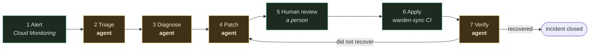
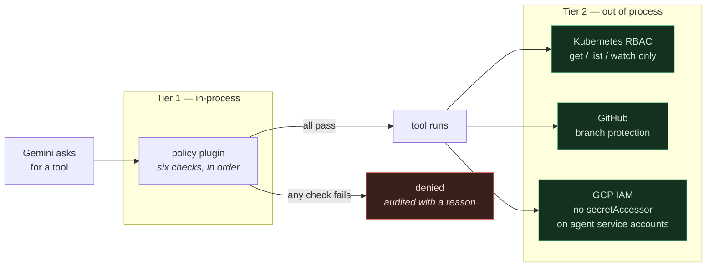
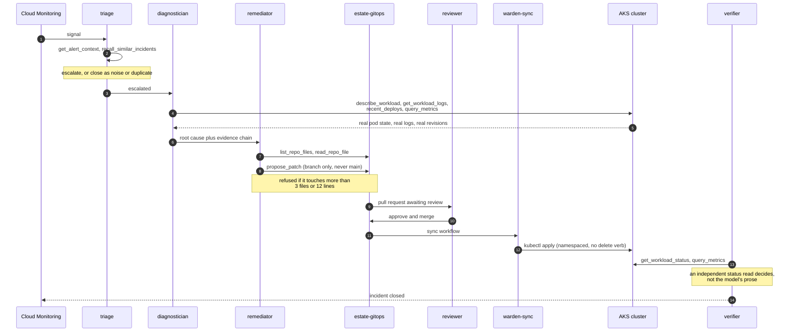

# Warden

A fleet of four autonomous SRE agents that watch a live Kubernetes estate, diagnose failures from real evidence, and land the fix as a reviewed pull request.

The whole system rests on one decision:

> No agent holds production write credentials. Their only write primitive is opening a pull request.

Everything else here — the policy plugin, the YAML manifests, the read-only ServiceAccount, the three verification scripts — exists to make that sentence true rather than merely printed.

Built for the All Things Agentic Hackathon, in the Fortified Enterprise Fleet category.

---

## Status, honestly

This section is first on purpose. A governance project that oversells itself is worse than one that admits its gaps.

There are six claims the design makes. Three are proven by a check that attempts the forbidden thing and gets refused. Two are implemented and one command away from being proven on your machine. One is an open gap, and the code says so at runtime.

| Claim | What enforces it | State |
| --- | --- | --- |
| An agent cannot call a tool it was not granted | ADK `before_tool_callback`, in-process | Proven — `make probe` |
| No agent can write to the cluster | `warden-reader` ServiceAccount, get/list/watch only | Proven — `verify-rbac.sh` |
| A patch cannot exceed its blast radius | Namespace, file count and line count, checked twice | Proven — policy and client tests |
| The logs a diagnosis rests on are real | Cluster CA pinned on the API connection | Implemented, needs the CA extracted |
| Only CI can change the estate | `warden-sync` ServiceAccount, namespaced, no delete verb | Implemented, needs applying |
| The agent cannot merge its own pull request | Nothing yet — see below | **Open gap** |

The last row is the one to read carefully. A fine-grained personal access token inherits the repository role of the human who minted it. We measured this: with branch protection enabled requiring one approving review, a direct commit to `main` using the agent's own token returned **HTTP 201** and landed. Narrow scopes decide which repositories and which APIs a token may touch. They do not decide who the token is.

So on the PAT path, "the agent cannot merge its own work" is true only because Warden's code never calls the merge endpoint. That is a promise, not a control. The fix is a GitHub App, which holds no repository role and cannot approve a pull request; it is about fifteen minutes of setup and is documented in [`docs/IDENTITY.md`](docs/IDENTITY.md).

Until that is done, Warden says so out loud: the demo header prints `boundary: NOT enforced`, every pull request footer carries the warning, and `verify-github-token.sh` exits non-zero.

One incident type has been fixed end to end against real infrastructure. A second is built and has never been run live. See [What it can actually fix](#what-it-can-actually-fix).

104 tests pass. No cloud project, API key or spend is required to run them.

---

## The shape of it

An incident moves through seven stages. The fleet occupies four of them.



Stages 1, 5 and 6 have no agent in them, and that is the point of the picture. Nothing the fleet does reaches the cluster without passing through a human and a CI credential no agent holds. `tests/test_live_view.py` asserts that no agent can ever appear in the review or apply columns.

### The four agents

Each is a separate LLM call with its own tool grants, its own token budget and its own YAML manifest.

**triage** — the phone screener. Sees only the alert text and past incidents. It has no cluster access at all. Decides severity, whether this duplicates an open incident, and whether it is worth waking the rest of the fleet. Most alerts should die here.

**diagnostician** — the investigator. Reads pod specs, container logs, deployment history and metrics from the live cluster. Holds no write scope of any kind, to the cluster or the repository. Produces one root cause with the evidence chain behind it.

**remediator** — the only agent that can change anything, and only one way. Reads the GitOps repository and opens a pull request. Capped at three files and twelve changed lines, enforced at the write path against the real diff.

**verifier** — the checker. After a merge, reads cluster status and metrics and decides whether the workload actually recovered. If not, it opens a revert pull request. It can propose a revert; it cannot apply one.

### What each agent may call

Thirteen tools exist in the catalog. Two of them are granted to nobody.

| Tool | triage | diagnostician | remediator | verifier | Reaches |
| --- | :---: | :---: | :---: | :---: | --- |
| `get_alert_context` | yes | | | | the alert itself |
| `recall_similar_incidents` | yes | | | | incident store |
| `describe_workload` | | yes | | | cluster, read |
| `get_workload_logs` | | yes | | | cluster, read |
| `recent_deploys` | | yes | | | cluster, read |
| `query_metrics` | | yes | | yes | cluster, read |
| `get_workload_status` | | | | yes | cluster, read |
| `list_repo_files` | | | yes | | repository, read |
| `read_repo_file` | | | yes | | repository, read |
| `propose_patch` | | | yes | | opens a pull request |
| `request_revert` | | | | yes | opens a pull request |
| `delete_workload` | | | | | nothing — granted to nobody |
| `scale_workload` | | | | | nothing — granted to nobody |

`delete_workload` and `scale_workload` are registered deliberately and granted to no manifest. An agent can genuinely attempt the call and policy genuinely refuses it. A denial demo against a tool that does not exist would prove nothing.

Run `make probe` to print this matrix from the live policy engine rather than from this table.

---

## How the governance actually works

Two independent tiers, so a failure in one does not become a breach.



Tier one runs six checks in order, and the first failure denies the call and writes an audit record with the reason:

1. **Kill switch.** One flag drains the whole fleet. It denies every tool for every agent, including read-only ones.
2. **Catalog membership.** A tool absent from `tools/catalog.py` cannot be called at all, and a manifest granting an unknown tool fails loudly at load time rather than mysteriously at run time.
3. **The manifest allow-list.** Whatever the model asks for, an agent gets only what its YAML grants.
4. **Scopes.** Each tool declares the scopes it costs; the agent must hold all of them.
5. **Blast radius.** Namespace, maximum files per patch, maximum changed lines.
6. **Budget.** Per-run token and tool-call ceilings, plus a circuit breaker that opens after three consecutive failures.

That tier is an ADK plugin, not a separate service. ADK's plugin hooks fire for every tool of every agent in the tree and run before per-agent callbacks, so there is no path around them from inside the process — and no network hop on the hot path.

The blast radius is checked **twice**: once here against the declared file list, and again at the write path against the real computed diff. Policy alone would not have caught the pull request that stayed inside one permitted file while deleting thirty-nine lines of it.

Tier two is why this is defence in depth rather than a single point of failure. The agent service accounts do not hold `roles/secretmanager.secretAccessor`, so even a hypothetically bypassed policy check leaves an agent unable to obtain a cluster or GitHub credential at all.

Two ADK contract details are load-bearing here and are easy to get wrong. Plugin callbacks are keyword-only and use `tool_args` / `result`, where the per-agent callbacks use `args` / `tool_response` — getting the names wrong means the hook silently never fires. And the tool is skipped whenever the return value is not `None`, but the callback chain only breaks on a *truthy* return, so returning `{}` blocks the tool while still iterating remaining callbacks. Always deny with a non-empty dict.

### One incident, in sequence



---

## What it can actually fix

A fix is possible when two things are true at once: the root cause is visible in what the diagnostician can read, and the fix is a small edit to a YAML file in the GitOps repository.

**Proven end to end against real infrastructure.** A wrong environment variable value — `htps://` instead of `https://` — crashlooping the service on startup. Real crashloop, real container logs, agent-authored one-line diff, human merge, cluster recovered. Pull requests #5 and #6 on `estate-gitops`.

**Built, never run live.** An OOMKilled workload: `inject.sh oom` sets the memory limit to 64Mi against a 128MB warm-up. The fix is a different edit to a different part of the same file, which is exactly why it is the valuable second test.

**The class it covers.** Wrong config values, resource limits set too low, a bad image tag, replica counts, misconfigured readiness or liveness probes, timeouts that are too aggressive.

**What it cannot do.**

- Anything needing an application code change. If the bug is in the service source rather than the manifest, the remediator has no access to it — it only holds the GitOps repository.
- Anything larger than three files or twelve changed lines. Refused at the write path, not merely discouraged. That cap exists because a live run once proposed a fix that also replaced the container image with one that did not exist and deleted thirty-nine lines of working entrypoint on the way.
- Anything outside the `demo` namespace. Refused by policy before dispatch.
- Anything requiring a cluster action rather than a file change — restarting a pod, draining a node, scaling up, rolling back.
- Anything whose evidence is not in logs, pod specs, deploy history or metrics. There is no distributed tracing and no APM, and `query_metrics` is derived from workload state rather than a real Prometheus. That is documented in the adapter and worth saying out loud rather than letting a reader discover it.

---

## Running it

Python 3.11 or newer. Node 18+ only if you want the dashboard.

### Everything below this line needs no cloud, no key, and no spend

```bash
git clone https://github.com/mazzyy/warden.git && cd warden
make install
cp .env.example .env
make doctor
```

`make doctor` prints what is configured, what is missing, and what you can run right now. It is the first thing to try when something does not work.

**One incident, end to end, offline.**

```bash
make demo
```

Injects a bad config into a fake in-memory estate and runs the whole fleet against scripted models. You get the full trace: every tool call, every allow and deny, the token count, the estimated cost, and a described pull request. Nothing is opened on GitHub.

`make demo-oom` runs the same loop against the other failure mode — an OOMKilled workload rather than a bad config — so you can see the fleet handle a different root cause without a cluster.

Scripted models are a development affordance. The hackathon requires unedited live execution, so the submitted video must run `--live`; the demo says so on screen every time you run it offline.

Every run writes to a file-backed store under `.warden-state/` and clears it first, so rehearsing three times does not open the fourth take on a wall of stale incidents. `--keep-history` appends instead, and `--memory` leaves no trace at all.

**The policy matrix.**

```bash
make probe
```

Evaluates every agent against every tool through the live policy engine and prints the result.

```bash
./.venv/bin/python -m warden.probe --assert-no-cluster-writes
```

That exits non-zero if any agent in the fleet can reach a cluster write. It runs as part of `make check`, so the central claim is a build failure rather than a sentence in a README.

**The test suite.**

```bash
make test     # 104 tests
make check    # lint, tests, and the no-cluster-writes assertion
```

**The operations dashboard.**

```bash
make dashboard
```

Builds the SPA if needed and serves it with the API on `http://localhost:8080`. Open it in one terminal and run an incident in another — the agents move on screen as they work. Click any tool call under *What it did* to see the arguments it was called with and the result it got back.

If no incident has ever run against the store, the header says SAMPLE DATA in amber until a real one arrives.

### Live models

Two paths, and they have different model catalogs.

**Vertex AI** — recommended. Uses application default credentials, no key in a file.

```bash
gcloud auth application-default login
```

In `.env`:

```
GOOGLE_GENAI_USE_ENTERPRISE=1
GOOGLE_CLOUD_PROJECT=your-project
GOOGLE_CLOUD_LOCATION=europe-west3
```

**Gemini API** — simpler to start, has a 5 requests-per-minute free tier that will rate-limit a four-agent incident. Warden retries and honours the server's own `retryDelay`, but expect a slow run.

```
GOOGLE_GENAI_USE_ENTERPRISE=0
GOOGLE_API_KEY=your-key
```

Check which models your credential can actually reach before trusting a manifest:

```bash
make models
```

The catalogs genuinely differ. `gemini-3.7-flash` exists on the Gemini API and 404s on Vertex in `europe-west3`. All four manifests currently pin `gemini-3.5-flash`, which is available on both.

```bash
make demo-live
```

### Live against a real cluster

You need an AKS cluster with the `estate-gitops` manifests applied. `infra/azure/main.tf` provisions one; see [`docs/SETUP.md`](docs/SETUP.md) for the full walkthrough.

Extract the read credential from the cluster:

```bash
cd ../estate-gitops
./scripts/extract-reader-credentials.sh
```

That script only reads. It prints four lines to paste into `warden/.env`, and it refuses to print anything unless the CA it found actually completes a TLS handshake against your API server first — a CA that does not verify is worse than none, because it fails mid-incident and looks like the cluster went down.

```
ESTATE_ADAPTER=aks
AKS_APISERVER=https://...
AKS_READER_TOKEN=...
AKS_CA_CERT_PATH=~/.warden/cluster-ca.crt
```

The CA is not optional. Skipping certificate verification does not weaken writes — the agent has no write scope to weaken. It weakens knowing who you are talking to, and the diagnostician's entire output is derived from the logs it reads. Feed it forged logs and it will open a confident, fully-evidenced pull request fixing a bug that never existed.

Then the full loop:

```bash
# 1. break something, the way a human breaks things: by committing it
cd ../estate-gitops
./scripts/inject.sh bad-config
sleep 45

# 2. run the fleet
cd ../warden
make demo-live

# 3. review the pull request it opened, then merge it

# 4. apply the merged change
cd ../estate-gitops
git pull
kubectl apply -f apps/checkout-svc/deployment.yaml
kubectl rollout status deploy/checkout-svc -n demo --timeout=180s

# 5. close the loop
cd ../warden
./.venv/bin/python -m warden.agents.demo --live --verify-only
```

Step 5 exists because the merge is a human action that happens after the demo process has exited. By the time verifying means anything, the process that would have done it is long gone. `--verify-only` runs the verifier alone against the last incident in the store, which is also what the GitHub webhook path does in production.

`./scripts/inject.sh restore` puts the estate back to known-good. Run it before every take.

---

## What you need to connect

| What | Why | Where it goes | Required for |
| --- | --- | --- | --- |
| Nothing | offline demo, tests, policy matrix | — | `make demo`, `make test`, `make probe` |
| Vertex ADC or a Gemini API key | live model calls | `.env` | `make demo-live` |
| GitHub fine-grained PAT | opening real pull requests | `GITHUB_TOKEN` in `.env` | live pull requests |
| GitHub App id, installation id, private key path | the enforced write boundary | `GITHUB_APP_*` in `.env` | closing the open gap |
| AKS API server, reader token, cluster CA | reading a real estate | `AKS_*` in `.env` | `ESTATE_ADAPTER=aks` |
| `KUBE_APISERVER`, `KUBE_TOKEN`, `KUBE_CA` | CI applying merged changes | GitHub repository secrets | the sync workflow |
| A Google Cloud project | Firestore, Cloud Run, Pub/Sub | `infra/gcp/main.tf` | deployment |

The GitHub token is scoped to `estate-gitops` only, with contents and pull-requests write and nothing else. The App private key is referenced by **path**, never pasted into `.env` — a PEM in a dotenv file gets shoulder-surfed on a screen share and committed by accident.

`.gitignore` covers `.env`, `.env.*` and `*.pem`. The `.env.*` glob is deliberate: a `.env.bak` made while editing still holds the token.

Secret Manager names are configured separately from secret values, and `config.py` refuses to start if what looks like a credential is pasted into a `SECRET_*` name field. That check exists because the failure is otherwise silent and baffling — the real token sits in `.env` in plain sight while the code looks up a Secret Manager secret named `github_pat_...`, finds nothing, and quietly runs in dry-run.

---

## The three proofs

Each lives in the `estate-gitops` repository and each attempts the forbidden action rather than reading a configuration value. All three are safe to run on camera.

```bash
./scripts/verify-rbac.sh            # the agent's read credential
./scripts/verify-sync-rbac.sh       # the CI applier's write credential
./scripts/verify-github-token.sh    # the agent's GitHub credential
```

`verify-rbac.sh` exists because the obvious version of this test is wrong. Running `kubectl --token=$TOKEN delete deploy/checkout-svc` appears to work — and it deletes the deployment. Not because RBAC failed, but because an AKS admin kubeconfig authenticates with **client certificates**, and Kubernetes authenticates a valid client cert regardless of any bearer token you also pass. The `--token` flag is silently ignored and the command runs as cluster-admin. `--kubeconfig=/dev/null` is what forces the token to be the only credential in play.

That mistake is the reason for the rule the rest of this project follows: a control you have not seen refuse something is not a control.

---

## Repository layout

```
warden/
  manifests/agents/       four YAML files — the fleet, as configuration
  warden/
    proxy/plugin.py       the choke point. Every tool call passes here
    control_plane/
      policy.py           pure functions: kill switch, catalog, scopes, blast radius
      registry.py         loads and validates manifests, rejects unknown tools
      budget.py           per-run token and tool-call ledger
      store.py            Store protocol, in-memory and Firestore
      jsonl_store.py      file-backed store shared by the demo and the dashboard
    estate/
      base.py             EstateAdapter protocol — the cloud-agnostic boundary
      aks.py              the real thing, read-only by contract and by credential
      fake.py             four failure modes, no cloud, free
    tools/
      catalog.py          every tool and the scopes it costs
      toolbox.py          binds tools to an incident
      github_client.py    the only write path in the system
    agents/
      definitions.py      the instructions. Prompts are source code here
      orchestrator.py     the pipeline, in plain Python rather than an ADK tree
      runtime.py          one agent run: budget, retries, usage accounting
      demo.py             the terminal trace
    dashboard/            FastAPI plus a React SPA, one service
    doctor.py             preflight: what is configured, what is missing
    probe.py              the policy matrix, and the CI assertion
    server.py             Pub/Sub push and GitHub webhook endpoints
  infra/azure/            AKS cluster, Free tier control plane
  infra/gcp/              Firestore, Pub/Sub, Artifact Registry, six service accounts
  docs/SETUP.md           cloud setup, verified command by command
  docs/IDENTITY.md        who the agent writes as, and why it matters
  tests/                  104 tests across 11 files
```

The orchestrator is deliberately plain Python rather than an ADK multi-agent delegation tree. Each agent gets its own run, its own budget and its own audit trail, and the handoffs between them are explicit and inspectable. When the demo is a live break-and-fix on camera, being able to point at exactly what happened and when is worth more than elegance.

---

## What the live runs found

Every one of these came from running against real infrastructure, not from a test. Each produced a permanent fix and a regression test. This list is the most useful thing in the repository, because it is the difference between a demo and a system.

| What happened | What it cost, and what fixed it |
| --- | --- |
| Triage closed an incident as a duplicate of itself | The incident is persisted before any agent runs, so recall handed it back. Bind the current incident and exclude it. |
| Two pull requests opened containing no changes | The agent wrote back content identical to what was there. No-op detection now deletes the branch and returns an error. An empty pull request claiming to fix something looks like success. |
| The remediator guessed file paths, 404ing twice per run | Added `list_repo_files`. Token use fell from 26,030 to 10,517. |
| The RBAC proof was fake | `kubectl --token` was silently ignored because the admin kubeconfig authenticates with client certificates. The delete succeeded and destroyed the deployment. |
| A pull request proposed a container image that does not exist and deleted 39 lines of working entrypoint | Root cause: `describe_workload` was not returning `command` and `args`, so the agent saw a bare base image and concluded it was wrong. Added those fields and a line-level blast radius. |
| The demo hardcoded `0/3 replicas ready` | False against the real cluster, where three replicas were serving fine. The alert is now read from the estate. A fabricated symptom grades the agents on the wrong thing. |
| The agent's PAT committed straight to a protected `main` — HTTP 201 | A PAT inherits its owner's repository role. Documented, warned about at runtime, and fixed properly by a GitHub App. |
| A blocked rollout reported itself as healthy | `ready == desired` is true for the entire duration of a blocked rollout, because the previous ReplicaSet is still serving. Triage read `3/3 replicas ready` and closed the incident, correctly, on a false sentence. Status now reads `updatedReplicas` and `ProgressDeadlineExceeded`. |
| Triage refused to escalate a real incident | Its instruction said an escalation "wastes an engineer's attention". True on a human rota, false here — escalating wakes three agents for a few cents. The cost model was wrong and Triage applied it correctly. |
| The sync workflow claimed to hold the only credential that can change the estate | It had never run, and its design wanted Contributor on the whole resource group — enough to delete the cluster — in order to patch one Deployment. |
| TLS verification was off against the real API server | Forged logs produce a confident diagnosis of a bug that never existed. The CA was in the same Secret as the token the whole time. |
| The token verification script read HTTP 403 as "no rule exists" | A credential that cannot read its own guardrail is behaving correctly. The script now attempts the write instead of reading configuration. |
| A tool that raised an exception was never audited | `after_tool_callback` does not fire on an error, so a cluster timeout left no trace. An audit log that drops failures reads as a clean run. |
| The result redactor missed `x-api-key` | It listed spellings instead of normalising keys. Caught by its own test, which is the only reason to write tests for a redactor. |

---

## What is remaining

Roughly in dependency order.

**Wire the CI applier.** `rbac/warden-sync.yaml` needs applying to the cluster, the replacement `sync.yml` needs moving into `.github/workflows/`, and `./scripts/ci-credentials.sh --set` pushes the three repository secrets through `gh` without the token touching your scrollback. Until then a human runs `kubectl apply`, and the Apply column in the pipeline is aspirational. About fifteen minutes.

**Turn on TLS verification.** One command, `./scripts/extract-reader-credentials.sh`, and four lines pasted into `.env`. Until then the demo header prints `tls NOT VERIFIED` on every run.

**Give the agent its own identity.** The GitHub App in `docs/IDENTITY.md`. This is the only open governance gap, and it is the one a judge is most likely to probe. About fifteen minutes of GitHub UI, no code.

**Run a second incident type live.** `./scripts/inject.sh oom` produces an OOMKilled workload — a different symptom, different evidence, and a different patch to a different part of the same file. Running it is what turns "it fixed a typo" into "it diagnoses root causes". This is the highest-value remaining item for the submission.

**Apply the Google Cloud Terraform.** `infra/gcp/main.tf` provisions Firestore, Pub/Sub, Artifact Registry, six service accounts with least-privilege bindings, empty Secret Manager containers and a five-dollar budget alert. Firestore is what lets the dashboard show incidents that outlive a local process.

**Deploy the dashboard to Cloud Run.** One service serving both the API and the built SPA, so there is one deploy and no CORS. A Cloud Monitoring uptime check against `/healthz` guards the demo URL through the judging window.

**Delete the stale branches.** Six `warden/*` branches from earlier runs are still on `estate-gitops`.

**Record the four-minute video.** Live, unedited execution is required by the rules. Rehearse three times, and run `./scripts/inject.sh restore` before every take.

**Write the Devpost submission.**

---

## Cost

One full incident against live Gemini costs roughly two tenths of a cent. A representative run: triage 3,456 tokens, diagnostician 18,136, remediator 13,532 — about $0.0015 in total, on `gemini-3.5-flash` through Vertex.

The asymmetry between agents is the argument for having four narrow ones instead of one large one. Triage costs a fiftieth of what the diagnostician costs and stops most runs before they begin. The diagnostician is expensive because it is the one reading real logs and correlating them against deploy history, which is where the value is.

Budget guards are enforced by the policy proxy before every dispatch: per-agent token ceilings, per-agent tool-call ceilings, and a circuit breaker that opens after three consecutive failures. `infra/gcp/main.tf` sets a five-dollar budget alert on the project, and `/healthz` degrades to HTTP 503 when spend crosses a configured fraction of the cap.

---

## Related repositories

[`estate-gitops`](https://github.com/mazzyy/estate-gitops) is the estate — the fake company's production, written down as files. It holds the service being managed, the namespace that defines the blast radius, both RBAC credentials, the fault injectors, the three verification scripts, and the CI workflow that applies merged changes.

It is a separate repository on purpose. If the two were one, the agent would need write access to its own source code and its own permission files. Keeping them apart means the agent proposes changes to the estate, never to itself — which is also why `rbac/**` is not among the sync workflow's trigger paths. A merged pull request must not be able to widen the permissions of the thing applying it.
